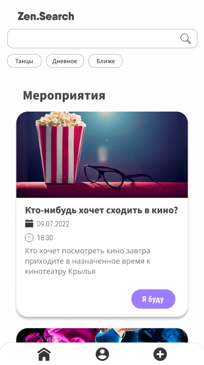
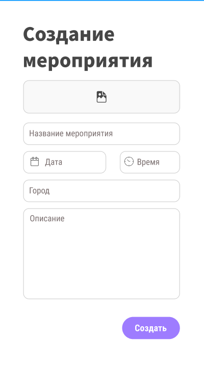

# Zen.Search
 _Вопрос досуга - не вопрос!_

### Полезность продукта

**1. Проблема**  
Активные люди в возрасте от 16 лет сталкиваются с проблемой нахождения мероприятий для проведения досуга.
В то же самое время организаторы небольших локальных мероприятий испытывают трудности в их анонсе и привлечении аудитории.  
 
На данный момент для того, чтобы узнать о возможных предстоящих событиях или анонсировать их, людям приходится вручную искать соответствующие сообщества/каналы/беседы и тп. 
 
**2. Решение**  
Создание мобильного приложения, позволяющего узнать предстоящие мероприятия в соответствии с интересами пользователя, его местоположением.   Организаторам событий предоставляет возможность анонсировать их.

**3. Ключевые метрики**
- Количество зарегистрировавшихся пользователей.
- Количество состоявшихся подтвержденных мероприятий.

**4. Уникальное ценностное предложение**  
Предлагаемое решение создает единую платформу для участников и организаторов локальных мероприятий, таким образом отпадает необходимость в ручном поиске мероприятия, интересующего пользователя, на различных платформах.

Продвинутая рекомендательная система, которая учитывает не только интересы и местоположение пользователя, но и время поиска. В результаты не попадают уже прошедшие/отмененные/не подтвержденные мероприятия.

Приложение также удобно автоматизирует процесс уведомления участников об отмене мероприятий и анонсе новых мероприятий понравившегося им организатора.

При записи на участие в каком-либо мероприятии представляется возможность предоставить приложению разрешение на занесение соответствующего напоминания в календарь.

**5. Нечестное преимущество**  
Одни из первых запускаем приложение, позволяющее найти локальные мероприятия исходя из интереса пользователя без привязки к определенному городу.

**6. Каналы**
- Реклама в группах/каналах, посвященных анонсу мероприятий в опр. городах.
- Информационные щиты в вузах

**7. Сегменты клиентов**
- Люди от 16 лет, заинтересованные в нахождении мероприятия в соответствии с их интересами для проведения досуга.
- Организаторы локальных мероприятий.
- Структура расходов

**8. Источники доходов**
- реклама мероприятий, их приоритетная рекомендация при поиске (платно, 300 р/неделя)
- процент с продаж билетов на мероприятие (от 1000 человек, 3% от суммы продаж)
- платный анонс мероприятия (100 - 1000 человек, 500 - 5000 р)

### Перспективы коммерциализации  
По итогам 2021 года объем рынка event-услуг только в столичном регионе оценивается в 28,7 млрд руб., что на 34,7% больше по сравнению с кризисным 2020 годом и показывает положительную тенденцию роста спроса на них.  
[Источник](https://marketing.rbc.ru/articles/13515/)

**На данный момент рынок предлагает следующие решения:**
1. **ВК.События**
+ Преимущества:
Подробное описание события.  
Возможность заявить об участии без использования сторонних сервисов.
+ Недостатки
В мобильном приложении (Сообщества → События) можно посмотреть только встречи, к которым вы уже присоединились. Рекомендованных или популярных мероприятий нет.  
Нет проверок на удаление из результатов поиска уже состоявшихся или отмененных мероприятий.  
Отсутствие возможности искать мероприятия по интересам (тегам).  
В мобильном приложении опция данный момент доступна только для СПб.  

2. **Яндекс.Афиша**
+ Преимущества:
Возможность покупки билетов внутри приложения.  
Мероприятия крупных организаторов.  
Возможность регистрации через разные платформы.
+ Недостатки:
Нельзя анонсировать своё мероприятие.  
Отсутствие анонсов небольших мероприятий, отличных от кино, театра, концертов.

3. **Каналы в сети Telegram**
+ Преимущества:
Представляют собой ленту анонсов разнообразных мероприятий разных масштабов.
+ Недостатки:
Сложно найти - легко потерять.  
Для регистрации на мероприятие необходимо использовать сторонние сервисы.  
Нет проверок на удаление из результатов поиска уже состоявшихся или отмененных мероприятий.  
Нет удобной системы уведомления пользователей об отмене мероприятия (сообщение может затеряться среди других постов / пользователь не проверит канал).

#### Приложение:
Главная страница | Создание анонса
:-------------------:|:------------:
 | 
